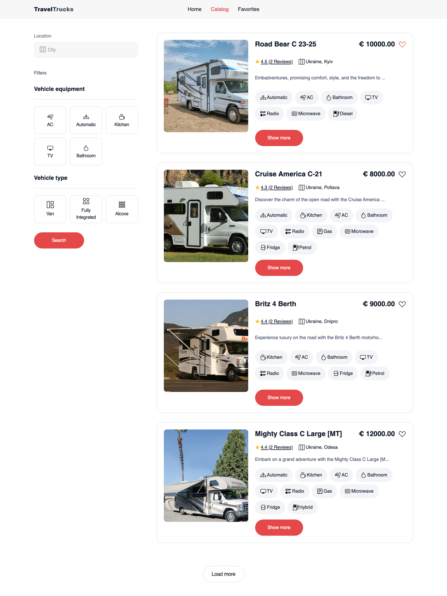

# Travel Trucks

The **Travel Trucks Rental App** is a user-friendly platform designed for adventurers and travel enthusiasts. It allows users to explore a variety of campers, curate a favorites list, and organize selections for easy trip planning. With features to view detailed camper profiles and manage bookings, this app makes it easier than ever to gear up for your next road adventure in the perfect travel truck!

## Technologies Used

1. **React.js + Vite:**
   This template provides a minimal setup to get React working in Vite with HMR and some ESLint rules.

2. **Tailwind CSS:**
   It’s used for styling, providing a utility-first approach that ensures a responsive and visually appealing design on all devices.

3. **Vercel:**
   The project is deployed on Vercel and can be viewed live at `https://travel-trucks-five-mu.vercel.app/`.

## Library & Tools Used

- **React:** JavaScript library for building user interfaces.
- **Redux & Redux Toolkit:** State management for handling application state.
- **React Router:** Declarative routing for React apps.
- **ReactDatePicker:** Date picker component for React.
- **React Helmet Async:** Allows dynamic manipulation of the document head.
- **React Hot Toast:** Notifications and toast messages.
- **React Loader Spinner:** Preloader spinner component for loading states.
- **Axios:** Promise-based HTTP client for making API requests.
- **Formik:** Form handling library for managing forms and validations.
- **Yup:** Schema builder for validation and error handling.
- **Redux Persist:** Middleware to save and rehydrate Redux state.
- **clsx:** Utility for conditionally joining classNames.
- **Modern Normalize:** CSS reset for consistent styling across browsers.
- **ESLint:** Linting tool to maintain code quality.
- **Date-fns:** JavaScript date utility library.
- **Autoprefixer:** Tool that adds vendor prefixes to CSS for cross-browser compatibility.
- **localStorage:** To persist user favorites across sessions.
- **web3forms:** Sending a form by email

## Features

- Browse a list of available campers.
- Filter campers by location.
- Filter campers by available equipment.
- Filter campers by type.
- Add and remove campers from a favorites list.
- Persist favorites list across page refreshes using localStorage.
- Automatically redirect users to a custom 404 page if an invalid URL is entered.

## Getting Started

To run the application locally, follow these steps:

1. Clone the repository: git clone `https://github.com/ViktorSvertoka/travel-trucks.git`
2. Install dependencies: `npm install`
3. Run the app: `npm run dev`
4. Open `http://localhost:5173` in your browser.

## License

This project is licensed under the MIT License.

